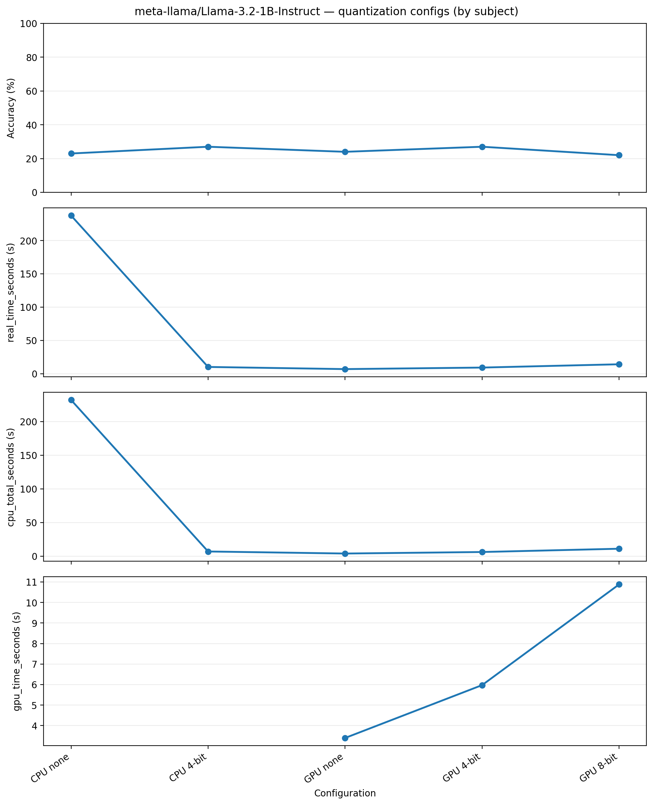
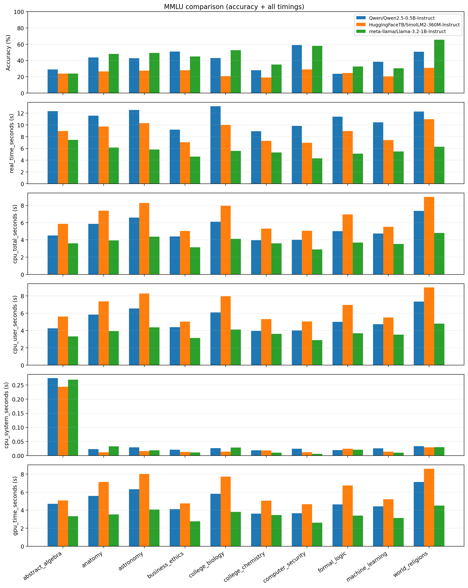

# Topic 1: Running an LLM — Portfolio Notes

This folder contains my work for UVA AI Agent class (Topic 1: **Running an LLM**): environment setup, running small LLMs locally, benchmarking on MMLU, and building a simple chat agent.

Most runnable code/scripts are in `Running an LLM/playground/`.

## Task 1 — Python environment + packages

I use `conda`.

```bash
conda create -n topic1 python=3.11 -y
conda activate topic1
```

Install the required packages:

```bash
python -m pip install transformers torch datasets accelerate tqdm huggingface_hub bitsandbytes
```

Notes:
- `bitsandbytes` 4-bit/8-bit quantization is typically **CUDA (NVIDIA GPU)** only.
- On CPU-only machines, run with `--quant none`.

## Task 2 — Hugging Face authentication (for Llama)

To download gated Llama models you must:
1) Create a Hugging Face account and token.
2) Accept the model license / request access.
3) Login on your machine.

Useful pages:

```text
https://huggingface.co/settings/tokens
https://huggingface.co/meta-llama/Llama-3.2-1B
https://huggingface.co/meta-llama/Llama-3.2-1B-Instruct
```

Login and verify:

```bash
hf auth login
hf whoami
```

## Task 3 — Verify setup with `llama_mmlu_eval.py`

The course starter scripts live in `Running an LLM/playground/`.

```bash
cd 'Running an LLM/playground'
bash fetch_course_files.sh
python llama_mmlu_eval.py --help
python llama_mmlu_eval.py
```

The script writes a timestamped `*.json` results file.

## Task 4 — Timing runs

Use shell timing:

```bash
cd 'Running an LLM/playground'
time python llama_mmlu_eval.py
```

I draw a line chart for CPU/GPU on different quantization.

Please, check my line chart and dicussion on results.pdf

Practical constraints:
- On my Linux laptop (no NVIDIA GPU), I can only do **CPU + no quantization** locally.
- GPU and 4-bit/8-bit quantization comparisons done on Colab.

## Task 5 — Script modifications (models, subjects, verbose, timing)

I extended the evaluation script (`Running an LLM/playground/llama_mmlu_eval.py`) to support:
- `--model`, `--subjects`, `--use-gpu/--cpu`, `--quant`
- `--verbose` to print per-question details
- timing fields in the JSON output (real/wall time, CPU time, and GPU time on CUDA)

### Run 10 MMLU subjects on 3 tiny/small models

```bash
cd 'Running an LLM/playground'

python llama_mmlu_eval.py --cpu --quant none \
  --model Qwen/Qwen2.5-0.5B-Instruct \
  --subjects abstract_algebra anatomy astronomy business_ethics college_biology college_chemistry computer_security formal_logic machine_learning world_religions

python llama_mmlu_eval.py --cpu --quant none \
  --model HuggingFaceTB/SmolLM2-360M-Instruct \
  --subjects abstract_algebra anatomy astronomy business_ethics college_biology college_chemistry computer_security formal_logic machine_learning world_religions

python llama_mmlu_eval.py --cpu --quant none \
  --model meta-llama/Llama-3.2-1B-Instruct \
  --subjects abstract_algebra anatomy astronomy business_ethics college_biology college_chemistry computer_security formal_logic machine_learning world_religions
```

### Per-question printing (`--verbose`)

```bash
cd 'Running an LLM/playground'
python llama_mmlu_eval.py --verbose --cpu --quant none \
  --model Qwen/Qwen2.5-0.5B-Instruct \
  --subjects astronomy business_ethics
```

With `--verbose` enabled, each example prints:
- question text
- A/B/C/D choices
- `predicted = X`
- `correct = Y`
- `result = RIGHT/WRONG`

### Timing fields in JSON

Each results JSON includes:
- overall: `timing.real_time_seconds`, `timing.cpu_*`, and `timing.gpu_time_seconds` (CUDA-only)
- per-subject: `subject_results[i].timing.*`

For example:
```json
{
  "model": "Qwen/Qwen2.5-0.5B-Instruct",
  "quantization_bits": null,
  "timestamp": "20260124_031645",
  "device": "cuda",
  "duration_seconds": 111.681166,
  "timing": {
    "real_time_seconds": 111.68118059299991,
    "cpu_user_seconds": 52.043181999999995,
    "cpu_system_seconds": 0.49781299999999984,
    "cpu_total_seconds": 52.540994999999995,
    "gpu_time_seconds": 50.02932180404663
  },
  "overall_accuracy": 41.37096774193548,
  "total_correct": 513,
  "total_questions": 1240,
  "subject_results": [
    {
      "subject": "abstract_algebra",
      "correct": 29,
      "total": 100,
      "accuracy": 28.999999999999996,
      "timing": {
        "real_time_seconds": 12.342007047000152,
        "cpu_user_seconds": 4.238720000000001,
        "cpu_system_seconds": 0.2738670000000001,
        "cpu_total_seconds": 4.512587000000001,
        "gpu_time_seconds": 4.707061321258545
      }
    },
    {
      "subject": "anatomy",
      "correct": 59,
      "total": 135,
      "accuracy": 43.7037037037037,
      "timing": {
        "real_time_seconds": 11.553136214999995,
        "cpu_user_seconds": 5.824107999999999,
        "cpu_system_seconds": 0.02322300000000066,
        "cpu_total_seconds": 5.847331,
        "gpu_time_seconds": 5.573057125091553
      }
    },
    {
      "subject": "astronomy",
      "correct": 65,
      "total": 152,
      "accuracy": 42.76315789473684,
      "timing": {
        "real_time_seconds": 12.525685988000077,
        "cpu_user_seconds": 6.543737999999998,
        "cpu_system_seconds": 0.02939899999999973,
        "cpu_total_seconds": 6.573136999999997,
        "gpu_time_seconds": 6.321451763153076
      }
    },
    {
      "subject": "business_ethics",
      "correct": 51,
      "total": 100,
      "accuracy": 51.0,
      "timing": {
        "real_time_seconds": 9.20592570299982,
        "cpu_user_seconds": 4.377496000000001,
        "cpu_system_seconds": 0.020787999999999585,
        "cpu_total_seconds": 4.398284,
        "gpu_time_seconds": 4.116165702819824
      }
    },
    {
      "subject": "college_biology",
      "correct": 62,
      "total": 144,
      "accuracy": 43.05555555555556,
      "timing": {
        "real_time_seconds": 13.180236851000018,
        "cpu_user_seconds": 6.088401999999995,
        "cpu_system_seconds": 0.026861999999999497,
        "cpu_total_seconds": 6.1152639999999945,
        "gpu_time_seconds": 5.820576629638672
      }
    },
    {
      "subject": "college_chemistry",
      "correct": 28,
      "total": 100,
      "accuracy": 28.000000000000004,
      "timing": {
        "real_time_seconds": 8.938875591999931,
        "cpu_user_seconds": 3.951186,
        "cpu_system_seconds": 0.0192060000000005,
        "cpu_total_seconds": 3.9703920000000004,
        "gpu_time_seconds": 3.612435665130615
      }
    },
    {
      "subject": "computer_security",
      "correct": 59,
      "total": 100,
      "accuracy": 59.0,
      "timing": {
        "real_time_seconds": 9.814674386999968,
        "cpu_user_seconds": 3.9889980000000023,
        "cpu_system_seconds": 0.024855999999999767,
        "cpu_total_seconds": 4.013854000000002,
        "gpu_time_seconds": 3.672915050506592
      }
    },
    {
      "subject": "formal_logic",
      "correct": 30,
      "total": 126,
      "accuracy": 23.809523809523807,
      "timing": {
        "real_time_seconds": 11.39946648099999,
        "cpu_user_seconds": 4.988833,
        "cpu_system_seconds": 0.019758999999999638,
        "cpu_total_seconds": 5.008591999999999,
        "gpu_time_seconds": 4.6498815612792965
      }
    },
    {
      "subject": "machine_learning",
      "correct": 43,
      "total": 112,
      "accuracy": 38.392857142857146,
      "timing": {
        "real_time_seconds": 10.447028261000014,
        "cpu_user_seconds": 4.719172999999998,
        "cpu_system_seconds": 0.02619100000000074,
        "cpu_total_seconds": 4.745363999999999,
        "gpu_time_seconds": 4.430514747619629
      }
    },
    {
      "subject": "world_religions",
      "correct": 87,
      "total": 171,
      "accuracy": 50.877192982456144,
      "timing": {
        "real_time_seconds": 12.272333272000196,
        "cpu_user_seconds": 7.320922999999993,
        "cpu_system_seconds": 0.033508000000000315,
        "cpu_total_seconds": 7.354430999999994,
        "gpu_time_seconds": 7.125262237548828
      }
    }
  ]
}
```

## Task 6 — Graphs
Notes/discussion: see `Running an LLM/results.pdf`.

Compare multiple runs/models:

```bash
cd 'Running an LLM/playground'
python plot_mmlu_compare.py <results1.json> <results2.json> <results3.json> --all-timings --out compare_all_timings.png
```

Please, check my bar chart and dicussion on results.pdf

Answer:
+ Abstract algebra, formal logic, and college chemistry are low for all three models.
+ SmolLM2 is consistently the weakest across most subjects.
+ Llama tends to lead on anatomy / astronomy / biology / world religions, while Qwen is comparatively strong on business ethics.

## Task 7 — Repeat on Google Colab

My Colab notebook is in `Running an LLM/playground/topic1.ipynb`.

## Task 8 — Chat agent (local)

Chat agent script: `Running an LLM/playground/simple_chat_agent.py`.

Implemented features:
- **Sliding window** for context management
- `--no-history` flag to disable conversation history (for comparison)

Run with sliding window (history ON):

```bash
cd 'Running an LLM/playground'
python3 simple_chat_agent.py --max-context-tokens 1024
```

Run with history OFF:

```bash
cd 'Running an LLM/playground'
python3 simple_chat_agent.py --no-history
```

compare:
- Ask a multi-turn question where the second prompt depends on the first.
- With history ON, the agent should stay on-topic.
- With history OFF, the agent may answer the follow-up without the needed context.

Result:
When I disable history, you can found LLM don't know I ask use case for cellular network. It think about LLM's use case.

```console
yanboyang713@Meta-Scientific-Linux ..ent-workshop/Running an LLM/playground (git)-[main] % python3 simple_chat_agent.py --no-history 
Loading model (this takes 1-2 minutes)...
✓ Model loaded! Using device: cpu
✓ Memory usage: ~2.5 GB (FP16)

======================================================================
Chat settings
======================================================================
Model: meta-llama/Llama-3.2-1B-Instruct
History: OFF
Sliding window: ON
Max context tokens: 2048
Max new tokens: 512
======================================================================

======================================================================
Chat started! Type 'quit' or 'exit' to end the conversation.
======================================================================

You: hello
Assistant: How can I help you today?

You: Do you know cellular network?
Assistant: Yes, I do know cellular networks. A cellular network, also known as a 4G network, is a type of wireless network that provides internet access, voice calls, and data transfer services. It uses cellular technology to connect devices to the internet.

Here's a brief overview:

* Cellular networks use radio waves to transmit data between devices, such as smartphones, laptops, and tablets.
* There are two main types of cellular networks: 2G (Second Generation) and 4G (Fourth Generation).
* 4G networks offer faster data speeds, typically up to 100 Mbps (megabits per second).
* Cellular networks use a network of cell towers, known as base stations, to provide coverage to a specific area.
* Users can move around freely, but may experience slower speeds and dropped calls if they are far from the nearest cell tower.

Cellular networks are widely used in many parts of the world, including the United States, Europe, and Asia. They are an essential part of modern life, enabling us to stay connected with friends, family, and the internet.

You: Could you give me some use case?                                                  
Assistant: Here are some use cases for our conversation:

1. **Language Translation**: You want to know the meaning of a word in a different language. I can translate it for you.
2. **Math Problem**: You have a math problem and need help solving it. I can assist you with calculations and explanations.
3. **Recipe Finding**: You're looking for a recipe and want suggestions. I can provide you with ideas and options.
4. **Wordplay**: You want to play a game of word association or have a fun conversation. I'm here to engage and entertain you.
5. **Conversational Dialogue**: You want to practice conversational skills or have a role-playing scenario. I can help you explore different scenarios.
6. **Information Retrieval**: You need help finding information on a specific topic. I can provide you with relevant resources and sources.
7. **Creative Writing**: You want to write a short story or poem. I can offer suggestions and ideas to help spark your creativity.

Which use case would you like to explore?
```

```console
yanboyang713@Meta-Scientific-Linux ..ent-workshop/Running an LLM/playground (git)-[main] % python3 simple_chat_agent.py --max-context-tokens 1024
Loading model (this takes 1-2 minutes)...
✓ Model loaded! Using device: cpu
✓ Memory usage: ~2.5 GB (FP16)

======================================================================
Chat settings
======================================================================
Model: meta-llama/Llama-3.2-1B-Instruct
History: ON
Sliding window: ON
Max context tokens: 1024
Max new tokens: 512
======================================================================

======================================================================
Chat started! Type 'quit' or 'exit' to end the conversation.
======================================================================

You: hello
Assistant: How can I help you today?

You: Do you know cellular network?
Assistant: Yes, I do know cellular networks. A cellular network, also known as a mobile network, is a type of wireless network that provides communication services to mobile devices such as smartphones, tablets, and laptops. It consists of:

1. **Cell towers**: These are tall structures that transmit and receive signals to and from mobile devices.
2. **Base stations**: Also known as cell sites, these are the main buildings that house the cell towers and provide coverage to a specific area.
3. **Mobile switching center**: This is the central office that manages the flow of calls and data between different cell towers and base stations.
4. **Network core**: This is the part of the network that processes and routes data, and is usually located in a data center.

Cellular networks use radio waves to transmit data, and they operate on a specific frequency band, such as GSM (Global System for Mobile Communications), UMTS (Universal Mobile Telecommunications System), or 4G (Fourth Generation). Each network has its own set of protocols, such as LTE (Long-Term Evolution), to manage the flow of data between devices and the network itself.

Do you have any specific questions about cellular networks?

You: Could you give me some use case?
Assistant: Here are some common use cases for cellular networks:

1. **Mobile Phone Calls**: Cellular networks provide reliable and frequent connectivity for making and receiving mobile phone calls.
2. **Internet Access**: Cellular networks offer mobile internet access, allowing users to browse the web, stream videos, and check email on-the-go.
3. **Text Messaging**: Cellular networks enable users to send and receive text messages, also known as SMS or MMS.
4. **Data Transfer**: Cellular networks provide a reliable and secure way to transfer data, such as photos, files, and emails, between devices.
5. **GPS Navigation**: Cellular networks use satellite signals to provide location-based services, such as GPS navigation and tracking.
6. **Emergency Services**: Cellular networks play a critical role in emergency services, such as 911 in the US, providing instant communication and access to emergency services.
7. **Video Calling**: Cellular networks enable users to make and receive video calls, using features like FaceTime, Skype, and WhatsApp.
8. **Streaming Media**: Cellular networks allow users to stream media content, such as music, videos, and live events, on-the-go.

Some specific use cases include:

* **Workplace**: Employees use cellular networks to stay connected and productive while working remotely.
* **Travel**: Travelers use cellular networks to stay connected with family and friends, and to access maps and other travel-related information.
* **Fitness and Sports**: Cellular networks enable athletes and fitness enthusiasts to track their progress, compete with others, and access training resources.
* **Business Operations**: Cellular networks support business operations, such as remote work, inventory management, and supply chain management.

These are just a few examples of the many use cases for cellular networks.

You: exit

Goodbye!
python3 simple_chat_agent.py --max-context-tokens 1024  506.75s user 10.36s system 256% cpu 3:21.62 total
```
