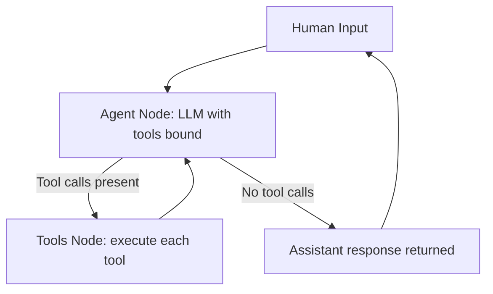

# Topic 3: Agent Tool Use

This directory contains my portfolio work for Topic 3.

## Table of contents

- `requirements.txt` - Python dependencies for Topic 3 scripts
- `task1_timing_commands.md` - commands and workflow for sequential vs parallel timing (local model vs Ollama)
- `task2_gpt4omini_test.py` - OpenAI API setup test with `gpt-4o-mini`
- `task3_manual_tool_handling_custom.py` - manual tool loop with custom calculator (geometry included)
- `task4_langgraph_tool_handling_custom.py` - LangChain/LangGraph-style tool loop with 4 tools
- `task5_langgraph_conversation_checkpoint.py` - single long conversation via LangGraph nodes + SQLite checkpointing/recovery
- `outputs/` - terminal traces, logs, and checkpoint DB files

## Environment setup

From repo root:

```bash
conda create -n topic3 -y python=3.12 jupyterlab -c conda-forge
conda activate topic3
pip install -r Topic3Tools/requirements.txt
```

Set your OpenAI key in your shell profile (do not commit secrets):

```bash
export OPENAI_API_KEY="your-actual-key"
```

## Task 1 observations (Ollama timing)

Using the logs:
- `outputs/task1/task1_sequential_ollama.txt`
- `outputs/task1/task1_parallel_ollama.txt`

Measured durations from the scripts:

| Run mode | Topic A: astronomy | Topic B: business_ethics | Combined wall-clock for both topics |
|---|---:|---:|---:|
| Sequential | 246.35 s | 171.61 s | 417.96 s |
| Parallel | 444.14 s | 361.02 s | ~444.14 s (the slower of the two) |

What I observed:
- Parallel was slower overall than sequential on this setup: about `26.18 s` slower (`~6.3%` slower wall-clock).
- Each individual job became much slower in parallel.
- `astronomy`: `246.35 s -> 444.14 s` (`~80%` slower).
- `business_ethics`: `171.61 s -> 361.02 s` (`~110%` slower).
- Accuracy stayed roughly similar:
- `astronomy` stayed at `25%` in both runs.
- `business_ethics` changed slightly (`31%` sequential vs `30%` parallel).

Interpretation:
- Running two clients against one local Ollama server/model on the same machine caused strong resource contention (CPU/RAM and model serving queueing).
- In this configuration, parallel launch did not create true speedup and instead increased latency per request.

## Task 2 notes

`client = OpenAI()`
- Constructs the OpenAI API client object and reads credentials/config from environment variables (especially `OPENAI_API_KEY`) unless explicitly provided.

`response = client.chat.completions.create(...)`
- Sends a chat completion request to the selected model with the provided messages and generation settings, then returns the model output (plus metadata like usage tokens).


```bash
python -u Topic3Tools/task2_gpt4omini_test.py 2>&1 | tee Topic3Tools/outputs/task2/task2_gpt4omini_test.txt

```

## Task 3 
```bash
python -u Topic3Tools/task3_manual_tool_handling_custom.py 2>&1 | tee Topic3Tools/outputs/task3/task3_manual.txt
```

## Task 4 
```bash
python -u Topic3Tools/task4_langgraph_tool_handling_custom.py 2>&1 | tee Topic3Tools/outputs/task4/task4_langgraph_tools.txt
```

## Task 5 
```bash
python -u Topic3Tools/task5_langgraph_conversation_checkpoint.py \
  --thread-id topic3-demo \
  --checkpoint-db Topic3Tools/outputs/task5/task5_checkpoints.db \
  2>&1 | tee Topic3Tools/outputs/task5/task5_chat.txt
```

Recovery test (start, stop, resume):

```bash
python -u Topic3Tools/task5_langgraph_conversation_checkpoint.py \
  --thread-id topic3-demo \
  --checkpoint-db Topic3Tools/outputs/task5/task5_checkpoints.db
```

Use the same `--thread-id` and `--checkpoint-db` on restart to recover state.

## Task 5 Mermaid diagram



## Task 6 question: missed parallelization opportunity

When the assistant emits multiple independent tool calls in one turn (for example two `count_letter` calls), the current tools node executes them sequentially.  
A clear optimization is to execute independent tool calls concurrently (thread pool or async gather), then feed all tool results back together.
