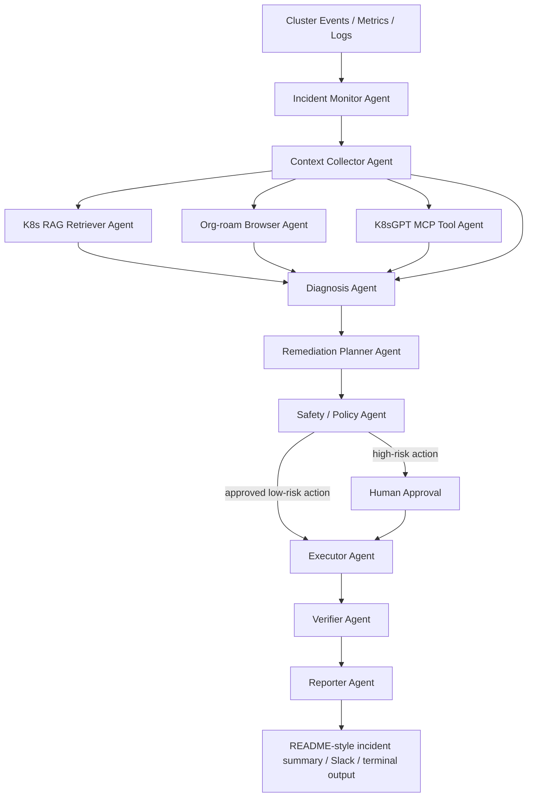

# Multi-Agent AIOps for Kubernetes Cluster Management

## Videos with slides
+ 5 mins video: https://youtu.be/zQZPOyFn0zg?si=UcY_wk2GKG3sc8NW
+ Slides: https://docs.google.com/presentation/d/12hhLbI3ievDBQ7gyMeHxwLkZ2l7IPR5IeL2giior5nA/edit?usp=sharing
+ workflow running logs: https://youtu.be/De4IYBkL8us?si=tolpQ28F8aUHqnWA

## Motivation

I built this project to explore whether a local, privacy-preserving multi-agent system can help with one of the most repetitive and stressful parts of platform engineering: Kubernetes incident response. In a real cluster, operators constantly switch between `kubectl`, dashboards, logs, metrics, and scattered runbooks. That context switching slows diagnosis and makes remediation inconsistent.

I wanted a system that could:

1. Watch the cluster for problems.
2. Pull in operational knowledge from my own notes instead of relying only on generic internet knowledge.
3. Suggest remediation steps and, when allowed by policy, execute approved remediation while keeping a human in the loop for risky actions.
4. Run fully on a local machine using Ollama and a local small language model rather than depending on a hosted model.

This makes the project a good AIOps case study: it combines observability signals, retrieval, reasoning, automation, and safety controls in a single workflow.

## Methods

### System Goal

The system is a local-first multi-agent assistant for Kubernetes cluster management. It detects incidents, gathers evidence from the live cluster, retrieves Kubernetes runbooks and operational context through a dedicated RAG pipeline, explores my Emacs Org-roam note graph through MCP tools, proposes a remediation plan, and can optionally execute approved remediation actions after policy checks.

For testing and demonstration, I use `minikube` as the local Kubernetes environment. This keeps the project reproducible on a single machine while still supporting realistic failure scenarios such as failed rollouts, broken ConfigMaps, bad image tags, and scheduling problems.

### Core Design Choices

#### 1. Local model with Ollama

I use Ollama as the local model runtime and `jingyaogong/minimind-3-moe:latest` as the base small language model for the AIOps workflow. It is fast enough for repeated local incident-response loops, and the benchmark results below show that it has the best throughput among the tested models on my machine. Gemma 4 remains useful as a comparison model or as an optional higher-capability fallback when more reasoning depth is worth the extra latency.

Recommended local setup:

- Base orchestration and diagnosis SLM: `jingyaogong/minimind-3-moe:latest`
- Comparison model: `gemma4:e4b`
- Optional higher-accuracy diagnosis model: `gemma4:26b`
- Local embedding model for retrieval: `embeddinggemma`

This keeps the project local-first while separating fast workflow execution from optional deeper reasoning. MiniMind-3-MoE handles the default agent loop, and the embedding model supports retrieval over Kubernetes runbooks, manifests, and incident notes.

#### 2. LangGraph as the workflow engine

I use LangGraph as the orchestration framework for the multi-agent workflow. This is a better fit than a simple ad hoc controller because the system has explicit stages, branching, approval gates, retries, and shared state passed between agents.

LangGraph is especially useful here because:

- each agent can be represented as a node with a clear responsibility
- routing decisions can depend on incident type, confidence, and risk level
- human approval can be modeled as an explicit checkpoint
- the shared incident state can be updated in a controlled, inspectable way
- the graph structure matches the actual AIOps workflow more naturally than a linear chain

#### 3. Hybrid knowledge architecture

Instead of forcing one memory system to do everything, I use two complementary knowledge layers:

- `org-roam-mcp` for note browsing, backlink exploration, and node-level context lookup
- Haystack + Qdrant for chunked Kubernetes RAG over runbooks, manifests, postmortems, and incident notes

This separation matters because Kubernetes operations are highly environment-specific, but the retrieval tasks are different. Some tasks need graph exploration across notes, while others need high-recall chunk retrieval over operational text.

For reproducible local runs, the repository stores captured workflow artifacts in `output/`, especially `output/result.json` for the final LangGraph state and `output/progress.log` for live progress and connector logs. The recommended run command uses `tee` so both streams remain visible on screen while also being saved.

The most useful personal knowledge is often:

- cluster naming conventions
- previous outage notes
- step-by-step runbooks
- deployment quirks
- known bad patterns
- service ownership notes

Org-roam is a strong fit for the browsing layer because it already stores notes as structured `.org` files with headings, tags, links, and graph metadata. Haystack + Qdrant is a stronger fit for the RAG layer because it supports chunk-level indexing, hybrid retrieval, filtering, and a clean evaluation pipeline.

### Hybrid Architecture Components

#### Org-roam MCP layer

`org-roam-mcp` is the MCP-accessible browser for my personal knowledge graph. Agents use it to:

- search note titles, tags, and aliases
- fetch a node and inspect its full content
- explore backlinks to related runbooks or retrospectives
- list Org-roam files and inspect graph neighborhoods

This is not the primary semantic retriever. It is the graph-aware note exploration layer.

#### Kubernetes RAG layer

Haystack orchestrates ingestion and retrieval, and Qdrant stores the vector index. This layer is used for high-recall retrieval over:

- Kubernetes runbooks
- Helm values and manifests
- incident write-ups and postmortems
- service-specific deployment notes
- sanitized logs and alert explanations

The RAG pipeline chunks documents by section, embeds them locally, and retrieves relevant passages using semantic search plus metadata filters such as namespace, service name, incident type, and environment.

#### Live cluster tool layer

K8sGPT MCP acts as the live cluster analysis and tool layer. It complements RAG by inspecting the current cluster state instead of only searching stored documents. Agents use it to:

- analyze workloads and cluster errors
- summarize likely Kubernetes misconfigurations
- provide live troubleshooting signals
- cross-check hypotheses produced by the diagnosis agent

### High-Level Architecture



### Multi-Agent Workflow

The system uses specialized agents instead of one monolithic agent. Each agent has a narrow responsibility and passes structured state to the next stage.

#### Agent 1: Incident Monitor

Purpose:
Detect abnormal cluster behavior and create an incident ticket for the rest of the workflow.

Inputs:

- Kubernetes events
- pod status changes
- rollout failures
- node health changes
- alert rules from Prometheus or Alertmanager

Outputs:

- incident type
- affected namespace and workloads
- severity estimate
- timestamp

Typical triggers:

- `CrashLoopBackOff`
- `ImagePullBackOff`
- `Pending` pods caused by resource pressure
- failing deployment rollout
- node `NotReady`
- sudden restart spikes

#### Agent 2: Context Collector

Purpose:
Gather raw evidence from the cluster before any reasoning starts.

Tools:

- `kubectl get pods -A`
- `kubectl describe pod`
- `kubectl get events -A --sort-by=.lastTimestamp`
- `kubectl rollout status`
- Prometheus queries
- log queries from Loki or `kubectl logs`

Outputs:

- structured cluster snapshot
- recent events
- relevant logs
- metrics summary
- object manifests for the affected workload

This agent is intentionally non-creative. Its job is to reduce hallucination by assembling concrete evidence first.

#### Agent 3: Kubernetes RAG Retriever

Purpose:
Retrieve the most relevant Kubernetes runbooks and incident knowledge from the indexed operations corpus.

How retrieval works:

1. Ingest runbooks, postmortems, manifests, and service notes into Haystack.
2. Chunk documents by section or heading rather than whole file.
3. Embed each chunk locally and store vectors in Qdrant.
4. Apply metadata filters such as namespace, workload, cluster, service, and incident type.
5. Return the top chunks plus citations to the source document and section.

Why this matters:

- incident language in logs rarely matches runbook wording exactly
- metadata filters improve precision for namespace-specific incidents
- chunk-level retrieval is better than file-level lookup for operational documents

#### Agent 4: Org-roam Browser

Purpose:
Explore my Org-roam knowledge graph through `org-roam-mcp` when the diagnosis needs personal context, related retrospectives, or backlink navigation.

Responsibilities:

- search notes by title, tags, or alias
- fetch node content for a promising note
- inspect backlinks to related procedures or incident notes
- surface note graph context that may explain recurring failures

Example use:

- the agent finds a note called "staging bootstrap issues"
- it follows backlinks to an earlier postmortem about missing secrets
- it passes that context to the diagnosis agent as supporting evidence

#### Agent 5: K8sGPT MCP Tool Agent

Purpose:
Query K8sGPT MCP for live cluster analysis that complements raw logs and retrieved documents.

Responsibilities:

- ask K8sGPT for workload-level analysis
- compare K8sGPT findings against retrieved runbooks
- surface Kubernetes-native explanations for errors such as probe failures, image issues, scheduling pressure, and RBAC mistakes

This layer is especially useful when there is very little historical documentation for the current incident.

#### Agent 6: Diagnosis Agent

Purpose:
Infer the most likely root cause by combining live cluster evidence, Kubernetes RAG results, Org-roam note context, and K8sGPT findings.

Responsibilities:

- classify the failure mode
- explain why the failure is happening
- identify missing evidence if confidence is low
- propose the smallest next diagnostic step

Example diagnosis output:

- Root cause hypothesis: deployment references a missing secret
- Evidence: `CreateContainerConfigError`, secret not found in `kubectl describe`, matching a Haystack-retrieved runbook section and an Org-roam note about a known staging bootstrap issue
- Confidence: medium
- Next check: verify whether the secret should be created by Helm post-install hooks

#### Agent 7: Remediation Planner

Purpose:
Convert the diagnosis into a stepwise response plan.

Responsibilities:

- produce ordered actions
- separate read-only validation from write actions
- estimate risk for each action
- provide rollback instructions

Example plan:

1. Confirm the missing secret name in deployment env references.
2. Check whether the Helm release created the secret in the wrong namespace.
3. If confirmed, recreate the secret from the approved template.
4. Restart the affected deployment.
5. Verify pod readiness and error-rate recovery.

#### Agent 8: Safety and Policy Agent

Purpose:
Block unsafe automation and require approval when appropriate.

Policy examples:

- read-only cluster inspection is always allowed
- restarting a single deployment in a non-production namespace can be auto-approved
- deleting pods in production requires human approval
- modifying RBAC, network policy, or cluster-wide resources always requires approval
- if confidence is low, prefer escalation over automation

This agent is critical. AIOps is only useful when it is safer than ad hoc operator behavior.

#### Agent 9: Executor

Purpose:
Execute approved actions through Kubernetes tools.

Possible actions:

- `kubectl rollout restart deployment/...`
- `kubectl scale`
- run Helm upgrade with a known values file
- open a ticket instead of mutating the cluster if the issue is too risky

The executor never invents commands. It only runs actions from an approved structured plan.

#### Agent 10: Verifier and Reporter

Purpose:
Confirm whether the remediation worked and write a human-readable summary.

Verification signals:

- pods become `Ready`
- rollout succeeds
- restart rate falls
- alert clears
- application latency or error rate improves

Final report includes:

- incident summary
- evidence used
- retrieved runbook passages and Org-roam note citations
- action taken
- result
- unresolved risks

### Why a Multi-Agent Design Instead of a Single Agent

A single-agent design is simpler, but it mixes evidence gathering, memory retrieval, reasoning, action planning, and execution into one prompt. That makes the system harder to debug and less safe. A multi-agent design is better for this project because:

- each stage can be inspected independently
- retrieval quality can be evaluated separately from diagnosis quality
- safety policies have a dedicated enforcement step
- structured outputs make it easier to compare runs across incidents
- human approval can be inserted at a precise point in the workflow

### Using Org-roam as an Operational Memory Graph

The most original part of the project is the use of Org-roam as the operator memory graph for the cluster assistant.

I treat Org-roam as more than a folder of text files. It is a graph of operational memory:

- runbooks connect to service notes
- service notes connect to incident retrospectives
- retrospectives connect to specific commands and lessons learned

That graph structure matters in AIOps. Many cluster problems are not solved by textbook Kubernetes knowledge; they are solved by remembering how a specific team, cluster, or application has failed before.

In the hybrid architecture, Org-roam is not treated as the only vector index. Instead, it plays a graph-navigation role through `org-roam-mcp`, while the main Kubernetes RAG pipeline is maintained separately in Haystack + Qdrant.

The Org-roam browsing workflow is:

1. Search for a note using title, tags, or aliases.
2. Fetch the selected node content.
3. Explore backlinks to related runbooks or retrospectives.
4. Pass those graph-neighbor notes to the diagnosis agent as additional evidence.

The Kubernetes RAG ingestion pipeline is:

1. Read runbooks, postmortems, manifests, and incident documents from the project corpus.
2. Split content by section or heading.
3. Attach metadata such as namespace, service, cluster, environment, and incident type.
4. Embed each chunk locally.
5. Store vectors in Qdrant.
6. Use Haystack retrievers to combine semantic retrieval with metadata filters and re-ranking.

Example useful note chunks:

- "How to recover a stuck ingress controller rollout"
- "Known issue: PVC binding fails in local lab cluster after node reboot"
- "Runbook: restart only the canary deployment, not the stable deployment"
- "Postmortem: service account token mount caused auth failure in namespace X"

### Shared State Passed Between Agents

Each agent reads and updates a shared incident state object. A minimal schema is:

```json
{
  "incident_id": "inc-2026-04-11-001",
  "trigger": "CrashLoopBackOff",
  "namespace": "payments",
  "workload": "api-server",
  "evidence": {
    "events": [],
    "logs": [],
    "metrics": [],
    "manifests": []
  },
  "retrieved_runbook_passages": [],
  "retrieved_org_roam_nodes": [],
  "k8sgpt_findings": [],
  "diagnosis": null,
  "plan": [],
  "risk_level": "unknown",
  "approval_required": true,
  "execution_result": null,
  "verification": null
}
```

This shared state makes the workflow reproducible and easier to grade for a class project.

### Example Incident Walkthrough

Scenario: a deployment enters `CrashLoopBackOff` after a new release.

1. The Incident Monitor detects repeated restarts and failed readiness probes.
2. The Context Collector gathers pod events, container logs, deployment manifests, and rollout status.
3. The Kubernetes RAG retriever returns a runbook section about missing ConfigMaps after release.
4. The Org-roam browser finds a related note titled "Post-release failures caused by missing config map in staging."
5. K8sGPT MCP confirms that the workload error pattern matches a configuration reference failure.
6. The Diagnosis Agent concludes that the pod references a non-existent ConfigMap.
7. The Planner proposes: verify the reference, restore the ConfigMap from the approved template, then restart the deployment.
8. The Safety Agent marks the config restore as medium risk and requires approval.
9. After approval, the Executor applies the ConfigMap and restarts the deployment.
10. The Verifier checks that pods become ready and that restart counts stop increasing.
11. The Reporter produces a concise incident report with retrieved passages, Org-roam note citations, and live-cluster evidence.

### Suggested Implementation Stack

- Agent workflow engine: LangGraph
- Local LLM runtime: Ollama
- Base SLM: `jingyaogong/minimind-3-moe:latest`
- Comparison model: `gemma4:e4b`
- Optional stronger model: `gemma4:26b`
- Embeddings: `embeddinggemma`
- Org-roam browser layer: `org-roam-mcp`
- RAG framework: Haystack
- Vector store: Qdrant
- Live cluster tool layer: K8sGPT MCP
- Test cluster: `minikube`
- Cluster access: `kubectl` plus the Kubernetes Python client
- Metrics: Prometheus
- Logs: Loki or `kubectl logs`
- Note source: Emacs Org-roam directory and metadata
- RAG corpus: runbooks, postmortems, manifests, Helm values, and incident notes

### Why Minikube for Testing

`minikube` is the best fit for this project because it provides a real Kubernetes API, supports common troubleshooting workflows, and is lightweight enough for a student project running on one machine. It also makes evaluation easier because I can repeatedly inject the same failure into the same local environment.

The local test workflow is:

1. Start a `minikube` cluster.
2. Deploy a small sample application and supporting services.
3. Introduce controlled faults such as missing secrets, bad image tags, broken probes, or resource pressure.
4. Let the multi-agent workflow observe, diagnose, and propose remediation.
5. Record diagnosis quality, safety behavior, and time to useful recommendation.
6. Verify resolution from both the workflow state and the live cluster by checking rollout success, pod readiness, and restored baseline image or ConfigMap state.

## Evaluation

I evaluated the local model choices with the Ollama token-throughput benchmark in this repository, then used those results to select the base SLM for the workflow. The broader incident-response evaluation is still designed as a mixed qualitative and task-based protocol: the goal is not to claim production-grade autonomy, but to test whether multi-agent local AIOps is more useful and safer than a simpler baseline.

### Local SLM Throughput Benchmark

The first table below was produced with `scripts/ollama_token_throughput_benchmark.py` on Intel N100 CPU. Each model ran three measured generations with 256 requested output tokens. All tested models completed without errors.

| Model | Runs | Median tok/s | Mean tok/s | Wall tok/s | Out toks | Errors |
| --- | ---: | ---: | ---: | ---: | ---: | ---: |
| `llama3.2:3b` | 3 | 10.134 | 10.153 | 9.94 | 256.0 | 0 |
| `qwen2.5:7b` | 3 | 5.128 | 5.065 | 5.064 | 256.0 | 0 |
| `deepseek-r1:7b` | 3 | 4.973 | 4.951 | 4.906 | 256.0 | 0 |
| `smollm2:1.7b` | 3 | 13.935 | 13.361 | 13.762 | 256.0 | 0 |
| `phi4-mini:3.8b` | 3 | 8.645 | 8.023 | 8.446 | 256.0 | 0 |
| `gemma3:4b` | 3 | 8.202 | 7.97 | 7.952 | 256.0 | 0 |
| `gemma4:e4b` | 3 | 6.792 | 6.753 | 6.618 | 256.0 | 0 |
| `jingyaogong/minimind2:latest` | 3 | 93.359 | 91.864 | 91.968 | 256.0 | 0 |
| `jingyaogong/minimind-3:latest` | 3 | 64.781 | 76.988 | 64.311 | 256.0 | 0 |
| `jingyaogong/minimind-3-moe:latest` | 3 | 155.055 | 149.708 | 150.226 | 256.0 | 0 |
| `hf.co/jingyaogong/minimind-3-gguf:minimind-3.q8.gguf` | 3 | 113.272 | 107.541 | 111.85 | 256.0 | 0 |

An additional run on an NVIDIA RTX 2070 GPU used the same benchmark shape: three measured generations with 256 requested output tokens. In this run, `gemma4:e4b` recorded one error and no completed measured runs.

| Model | Runs | Median tok/s | Mean tok/s | Wall tok/s | Out toks | Errors |
| --- | ---: | ---: | ---: | ---: | ---: | ---: |
| `llama3.2:3b` | 3 | 139.355 | 139.335 | 111.53 | 256.0 | 0 |
| `qwen2.5:7b` | 3 | 72.705 | 72.719 | 63.526 | 256.0 | 0 |
| `deepseek-r1:7b` | 3 | 72.843 | 72.841 | 62.61 | 256.0 | 0 |
| `smollm2:1.7b` | 3 | 177.004 | 177.03 | 155.784 | 256.0 | 0 |
| `phi4-mini:3.8b` | 3 | 114.381 | 114.321 | 88.326 | 256.0 | 0 |
| `gemma3:4b` | 3 | 95.057 | 94.62 | 82.512 | 256.0 | 0 |
| `gemma4:e4b` | 0 | None | None | None | None | 1 |
| `jingyaogong/minimind2:latest` | 3 | 671.195 | 659.447 | 614.664 | 256.0 | 0 |
| `jingyaogong/minimind-3:latest` | 3 | 1294.78 | 1235.172 | 1090.719 | 256.0 | 0 |
| `jingyaogong/minimind-3-moe:latest` | 3 | 1079.687 | 1039.208 | 1015.588 | 256.0 | 0 |
| `hf.co/jingyaogong/minimind-3-gguf:minimind-3.q8.gguf` | 3 | 1286.361 | 1204.899 | 1202.291 | 256.0 | 0 |

Based on the initial CPU measurements, I use `jingyaogong/minimind-3-moe:latest` as the base SLM. It had the highest median output throughput in that benchmark, which matters for an agent workflow that may call the model several times during one incident.

### Evaluation Questions

1. Does Kubernetes RAG improve diagnosis quality?
2. Does Org-roam graph exploration add useful local context beyond standard retrieval?
3. Is the multi-agent workflow more reliable than a single-agent workflow?
4. Does the safety gate reduce risky or unnecessary actions?
5. Do users find the system helpful for understanding incidents?

### Test Scenarios

I would evaluate on a small but representative set of `minikube` incident scenarios:

1. `CrashLoopBackOff` caused by missing environment variable or secret
2. `ImagePullBackOff` caused by a bad image tag
3. `Pending` pod caused by CPU or memory requests exceeding node capacity
4. failed deployment rollout caused by readiness probe misconfiguration
5. node `NotReady` causing workload disruption
6. service outage caused by wrong ConfigMap values after deployment

### Baselines

To make the evaluation meaningful, I would compare four systems:

1. Single-agent without RAG
2. Single-agent with Kubernetes RAG only
3. Multi-agent with Kubernetes RAG
4. Multi-agent with Kubernetes RAG plus Org-roam MCP browsing

This isolates the effect of retrieval, workflow decomposition, and note-graph augmentation.

### Metrics

The most useful metrics for this project are:

- diagnosis accuracy: did the system identify the real cause?
- plan quality: were the proposed remediation steps relevant and correctly ordered?
- unsafe action rate: how often did the system suggest a risky action without proper justification?
- time to first useful recommendation
- verification success: did the system correctly determine whether the fix worked?
- user rating: how helpful was the final report on a 1 to 5 scale?

### Qualitative User Study

For the qualitative part, I would ask a few lab partners to use the system on prepared incident scenarios and rate:

- clarity of the explanation
- usefulness of retrieved notes
- trust in the proposed action plan
- perceived safety of the system

This is a good fit for the course because it measures whether the system is understandable, not just whether it produces text.

Because the scenarios run on `minikube`, each participant can be given the same starting cluster state, which makes the comparison more fair and repeatable.

### Expected Outcome

My hypothesis is:

- Haystack + Qdrant RAG will improve relevance because the indexed corpus contains local runbooks and prior incidents.
- Org-roam MCP browsing will add context for recurring problems by surfacing related notes and backlinks.
- The multi-agent workflow will reduce hallucinations because evidence collection happens before diagnosis.
- The safety agent will reduce dangerous commands, especially on ambiguous incidents.
- The weakest part of the system will still be action selection on novel failures that are not covered by logs or prior notes.

Even if the system does not fully automate remediation, it can still be successful if it shortens the time from alert to a justified next step.

## Conclusions

This project shows that AIOps does not need to start with a large cloud platform. A useful cluster assistant can be built locally by combining three ideas:

1. a fast local SLM through Ollama
2. specialized agents with clear responsibilities
3. hybrid knowledge access through Kubernetes RAG plus personal operational memory in Org-roam

The main lesson is that knowledge matters as much as model size. Generic model knowledge is not enough for Kubernetes operations in a specific environment. Personal notes, runbooks, and postmortems give the system the context it needs to make better recommendations.

The second lesson is that multi-agent design is most valuable when it improves safety and auditability, not just when it looks more advanced. Separating monitoring, retrieval, diagnosis, planning, execution, and verification makes the workflow easier to inspect and control.

The final lesson is that full autonomy is not the right goal for a student AIOps project. The better goal is high-quality decision support with careful automation of low-risk tasks and human approval for anything dangerous. That framing makes the system more realistic and more responsible.

If I continued this project, the next steps would be:

- build a reusable `minikube` demo environment with scripted fault injection
- ingest real Org-roam notes and a structured Kubernetes operations corpus into Haystack + Qdrant
- integrate K8sGPT MCP for live cluster checks during diagnosis
- add a replay harness for repeatable incident evaluation
- measure how often retrieval changes the final diagnosis
- formalize policy rules for production versus non-production namespaces

## Summary

In this project, I designed a local-first multi-agent Kubernetes AIOps assistant that uses MiniMind-3-MoE in Ollama as the base SLM, `org-roam-mcp` for note browsing and backlink exploration, Haystack + Qdrant for Kubernetes RAG, and K8sGPT MCP as a live cluster tool layer. The workflow monitors incidents, collects evidence, retrieves relevant runbook passages, explores related Org-roam notes, diagnoses problems, plans remediations, enforces safety checks, executes approved actions, and verifies outcomes. The design is motivated by the need for faster, safer, and more context-aware Kubernetes operations. The most important insight is that hybrid knowledge access plus structured agent responsibilities can make an AI assistant more useful than a single large prompt, especially when the task is incident response.
